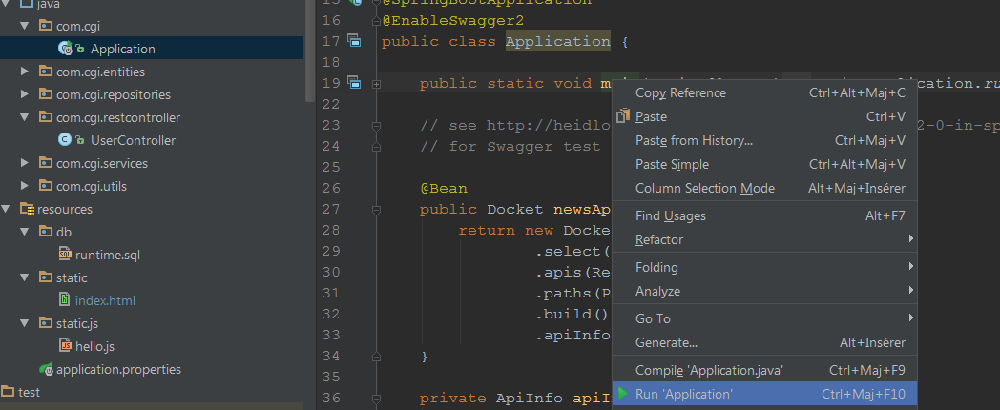

# springboot-restservices-sandbox

springboot-restservices-sandbox with :

 - REST controllers (GET, POST, DELETE, and PATCH)
 - Spring DATA and h2 database in runtime
 - Swagger2
 - React JS frontend in springboot's resources
 
## Build and RUN

 - `mvn clean package` (build back and front with npm and browserify, all incluse)
 - `java -jar target/springboot-restservices-sandbox-0.1.0.jar` (use Embedded Tomcat), see http://localhost:8080/api/users (to change port : `-Dserver.port=XXXX` for instance : `java -Dserver.port=8888 -jar target/springboot-restservices-sandbox-0.1.0.jar`)
 - for the IU : http://localhost:8080/api
 
## Tests services & controllers

 - TU with H2 (see test.properties and test.sql for loading H2)
 - Swagger : http://localhost:8080/api/swagger-ui.html
 
## DATA h2

```
INSERT INTO public.users(id, name, email, userdetail) VALUES (0, 'gui', 'gui@gmail.com', '{"postsNb": 11, "followersNb": 2, "followingNb": 0, "suggestions": [2, 3, 4, 5]}');
```

## Frontend

 - react : https://github.com/facebook/react/
 - react-router : https://github.com/ReactTraining/react-router
 - whatwg-fetch : https://github.com/github/fetch (A window.fetch JavaScript polyfill.)
 - promise : https://github.com/then/promise (Just a pure ES6 polyfill)
 - redux (but not used) : https://github.com/reactjs/redux (Predictable state container for JavaScript apps)
 - Browser-side require() the node.js way : https://github.com/browserify/browserify (To bundle app.js)
 - Babel browserify transform : https://github.com/babel/babelify
 - Watch mode for browserify builds : https://github.com/browserify/watchify
 - css light : https://milligram.io/


## JSON user

```
  {
    "id": 0,
    "name": "gui",
    "email": "gui@gmail.com",
    "userDetail": {
      "postsNb": 11,
      "followersNb": 2,
      "followingNb": 0,
      "suggestions": [2, 3]
    }
  }
  
  Patch examples :
  
  [{
  	"op": "replace",
  	"path": "/userDetail/followingNb",
  	"value": 111
  }]

  Or :
  
  [{
   "op": "replace",
   "path": "/userDetail",
   "value": {
    "postsNb": 111,
    "followersNb": 222,
    "followingNb": 333,
    "suggestions": [444]
   }
  }]

  Or (Adds a value to an object or inserts it into an array.
  In the case of an array, the value is inserted before the given index.
  The - character can be used instead of an index to insert at the end of an array. see http://jsonpatch.com/) :

  [{
  	"op": "add",
  	"path": "/userDetail/suggestions/-",
  	"value": 4
  }]
  
  
```

## DevTools

Add :

```
<dependencies>
    <dependency>
        <groupId>org.springframework.boot</groupId>
        <artifactId>spring-boot-devtools</artifactId>
        <optional>true</optional>
    </dependency>
</dependencies>
```

 - https://docs.spring.io/spring-boot/docs/current/reference/html/using-boot-devtools.html
 - https://github.com/spring-projects/spring-boot/issues/3315
 - With IDEA : Run 'Application', Build -> Make Project
 



## Links

 - https://github.com/spring-guides/gs-accessing-data-jpa
 - https://github.com/spring-guides/gs-rest-service
 - https://docs.spring.io/spring-boot/docs/current/reference/html/common-application-properties.html
 - https://docs.spring.io/spring-boot/docs/current/reference/html/boot-features-testing.html
 - https://docs.spring.io/spring-boot/docs/current/reference/html/boot-features-sql.html
 - http://jsonpatch.com/
